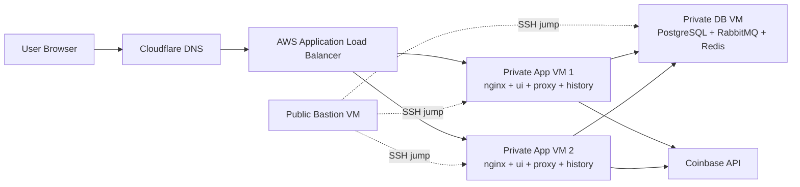

# Currency Rates Tracker

Currency Rates Tracker is a multi-service crypto price application. It collects live prices, stores historical data, and serves a web UI through an AWS Application Load Balancer.

The current working tree has moved from the older local/Vagrant deployment model to an AWS cloud deployment model with Terraform, Ansible, Docker Compose, ALB, private app/database VMs, and optional Cloudflare DNS.

## What Changed From The GitHub Baseline

Compared with `origin/kurdupel` on `https://github.com/rkurdupel/status`, the new implementation changes the deployment architecture.

Major changes:

1. Replaced the old single `devops-data` Vagrant-style data VM flow with AWS infrastructure.
2. Added AWS public/private networking:
   - public subnet for bastion and ALB
   - private subnet for DB and app VMs
   - NAT Gateway for private VM outbound internet access
   - second public subnet in another Availability Zone for ALB
3. Added an Application Load Balancer:
   - public HTTP entry point
   - target group for app VMs
   - `/health` checks
   - load balancing across `app-1` and `app-2`
   - sticky sessions with ALB cookie
4. Split VM roles:
   - `bastion` is public and used for SSH jump access
   - `db` is private and runs PostgreSQL, RabbitMQ, and Redis
   - `app-1` and `app-2` are private and run nginx, UI, proxy, and history containers
5. Added separate security groups:
   - bastion accepts SSH only from the operator IP
   - app VMs accept HTTP only from the ALB
   - DB VM accepts PostgreSQL, RabbitMQ, and Redis only from app VMs
6. Added Cloudflare DNS support:
   - creates a CNAME record pointing a hostname to the ALB DNS name
7. Replaced old Ansible roles for native PostgreSQL/RabbitMQ/Redis installs with Docker Compose templates on cloud VMs.
8. Added Terraform outputs for generated Ansible inventory and SSH config.
9. Changed `history_service` to read `POSTGRES_PASSWORD` and connect to PostgreSQL with `sslmode=disable`.

Security note: do not commit real AWS keys, Cloudflare tokens, passwords, or generated Terraform provider directories. If any real credentials were committed or shared, rotate them.

## Current Architecture



Request flow:

1. User opens the Cloudflare hostname or ALB DNS name.
2. ALB receives HTTP traffic on port `80`.
3. ALB forwards the request to a healthy app VM.
4. nginx on the app VM serves `/health` directly and proxies app traffic to containers.
5. UI calls the proxy service for live prices.
6. Proxy fetches live prices from Coinbase and publishes messages to RabbitMQ.
7. History service consumes RabbitMQ messages and stores rows in PostgreSQL.
8. UI reads historical/chart data from the history service.
9. UI stores session state in Redis.

## Repository Structure

```text
.
├── config/config.yml
├── terraform/
│   ├── main.tf
│   ├── provider.tf
│   ├── versions.tf
│   ├── variables.tf
│   ├── outputs.tf
│   └── modules/aws/
│       ├── network/
│       ├── firewall/
│       ├── vm/
│       └── load_balancer/
├── ansible/
│   ├── cloud-provision.yml
│   ├── cloud-deploy.yml
│   ├── inventory.cloud
│   ├── roles/
│   └── templates/
├── scripts/
│   ├── post-apply.sh
│   └── verify_failover.sh
├── ui/
├── proxy_service/
└── history_service/
```

Important files:

- `config/config.yml` controls cloud, region, CIDRs, VM names, VM IPs, and tags.
- `terraform/modules/aws/network` creates VPC, public/private subnets, route tables, Internet Gateway, NAT Gateway, and second public subnet for ALB.
- `terraform/modules/aws/firewall` creates bastion, app/private, DB, and ALB security groups.
- `terraform/modules/aws/load_balancer` creates the ALB, target group, listener, health check, and stickiness.
- `terraform/modules/aws/main.tf` wires VMs, ALB target attachments, and Cloudflare DNS.
- `ansible/cloud-provision.yml` installs common packages and Docker on cloud VMs.
- `ansible/cloud-deploy.yml` deploys Docker Compose stacks to DB and app VMs.
- `ansible/templates/cloud-nginx.conf.j2` defines `/health`, `/api`, `/history-api`, and UI proxying.

## Prerequisites

Install locally:

- Terraform
- AWS CLI
- Ansible
- SSH client
- Docker only if you also run the local compose stack

You need:

- AWS credentials with permission to create VPC, EC2, security groups, NAT Gateway, ALB, target groups, and S3 backend access.
- Existing S3 backend bucket configured in `terraform/backend.tf`.
- SSH public key path from `config/config.yml`.
- Cloudflare API token with DNS edit permission for the target zone.
- Cloudflare zone ID.

## Required Environment Variables

Export these before Terraform and Ansible.

```bash
export AWS_ACCESS_KEY_ID="<aws-access-key>"
export AWS_SECRET_ACCESS_KEY="<aws-secret-key>"
export AWS_DEFAULT_REGION="eu-central-1"

export SSH_KEY_PATH="$HOME/.ssh/id_ed25519"

export POSTGRES_USER="currency_app_user"
export POSTGRES_PASS="<postgres-password>"
export POSTGRES_DB="currency_rates_tracker"
export POSTGRES_TABLE="currency_rates"

export RABBITMQ_USER="currency_app_user"
export RABBITMQ_PASS="<rabbitmq-password>"
export RABBITMQ_QUEUE="currency_rates"

export REDIS_PASSWORD="<redis-password>"
export SECRET_KEY="<flask-secret-key>"

export TF_VAR_cloudflare_api_token="<cloudflare-api-token>"
export TF_VAR_cloudflare_zone_id="<cloudflare-zone-id>"
```

Cloudflare token format must be only the raw token. Do not include `Bearer`, quotes inside the value, spaces, or newlines.

## Deploy To AWS

### 1. Review Config

Check `config/config.yml`:

```yaml
cloud: aws
location: eu-central-1

network:
  cidr: 10.10.0.0/16
  subnet_cidr: 10.10.0.0/24
  private_subnet_cidr: 10.10.1.0/24
  second_public_subnet_cidr: 10.10.2.0/24

instances:
  bastion:
    public: true
    private_ip: 10.10.0.10
  db:
    public: false
    private_ip: 10.10.1.11
  app-1:
    public: false
    private_ip: 10.10.1.12
  app-2:
    public: false
    private_ip: 10.10.1.13
```

### 2. Create Infrastructure

```bash
cd terraform
terraform init -upgrade
terraform plan
terraform apply
```

Useful outputs:

```bash
terraform output alb_dns_name
terraform output bastion_public_ip
terraform output -raw ansible_inventory
terraform output -raw ssh_config
```

### 3. Generate Inventory And SSH Config

From repo root:

```bash
./scripts/post-apply.sh
```

This writes:

- `ansible/inventory.cloud`
- `~/.ssh/coinops-aws.generated`

It also adds an `Include` line to `~/.ssh/config` if needed.

Test SSH:

```bash
ssh coinops-bastion
ssh coinops-db
ssh coinops-app-1
ssh coinops-app-2
```

### 4. Provision VMs

From repo root:

```bash
ansible-playbook -i ansible/inventory.cloud ansible/cloud-provision.yml
```

This installs common packages and Docker on all cloud nodes, then creates persistent data directories on the DB VM.

### 5. Deploy Containers

```bash
ansible-playbook -i ansible/inventory.cloud ansible/cloud-deploy.yml
```

This deploys:

- DB VM:
  - PostgreSQL on `5432`
  - RabbitMQ on `5672`
  - Redis on `6379`
- App VMs:
  - nginx on host port `80`
  - UI container on `5000`
  - proxy container on `5001`
  - history container on `5002`

The app deploy uses `docker compose up -d --build --remove-orphans`, so code changes are rebuilt during deployment.

### 6. Open The Website

For AWS deployments, use the ALB DNS name:

```bash
terraform -chdir=terraform output -raw alb_dns_name
```

Then open:

```text
http://<alb-dns-name>
```

If Cloudflare DNS was applied, open the configured hostname, for example:

```text
http://app.<your-domain>
```

For the current GCP setup in this repo, the app VMs are private and do not expose a public website endpoint. Use an SSH tunnel through the bastion to reach `app-1` from your browser:

```bash
ssh -N -L 19080:127.0.0.1:80 -J rkurdupel@<bastion-public-ip> rkurdupel@10.10.1.12
```

Then open:

```text
http://127.0.0.1:19080
```

## Verify Deployment

Check ALB health:

```bash
curl -i "http://$(terraform -chdir=terraform output -raw alb_dns_name)/health"
```

Expected:

```text
HTTP/1.1 200 OK
{"status": "ok"}
```

Check app VMs directly through SSH:

```bash
ssh coinops-app-1 'curl -i http://localhost/health'
ssh coinops-app-2 'curl -i http://localhost/health'
```

Check containers:

```bash
ssh coinops-db 'cd /opt/coinops/cloud-db && sudo docker compose ps'
ssh coinops-app-1 'cd /opt/coinops/cloud-app && sudo docker compose ps'
ssh coinops-app-2 'cd /opt/coinops/cloud-app && sudo docker compose ps'
```

Check logs:

```bash
ssh coinops-app-1 'sudo docker logs cloud-app-nginx-1 --tail 50'
ssh coinops-app-1 'sudo docker logs cloud-app-ui-1 --tail 50'
ssh coinops-app-1 'sudo docker logs cloud-app-proxy-1 --tail 50'
ssh coinops-app-1 'sudo docker logs cloud-app-history-1 --tail 50'
```

## Failover Test

The helper script checks that the app still responds after one app VM is stopped:

```bash
./scripts/verify_failover.sh
```

Review the hard-coded ALB URL, AWS region, and target group ARN in the script before running it in a new environment.

## How The ALB Works

The ALB is the public website entry point:

```text
User -> ALB -> app-1/app-2
```

The app VMs are private. Users do not access them directly.

The ALB target group:

- sends traffic only to registered app VMs
- calls `/health` every 30 seconds
- marks a VM healthy after 2 successful checks
- marks a VM unhealthy after 3 failed checks
- stops sending traffic to unhealthy VMs

Stickiness is enabled with an ALB cookie:

```hcl
stickiness {
  type            = "lb_cookie"
  cookie_duration = 86400
  enabled         = true
}
```

This keeps the same browser on the same app VM for a day. It helps avoid inconsistent UI session behavior when a user clicks between coins or ranges while multiple app VMs are running.

## Troubleshooting

### ALB Returns 504

Meaning: ALB accepted the request but did not get a timely response from a target.

Check:

```bash
curl -i "http://$(terraform -chdir=terraform output -raw alb_dns_name)/health"
ssh coinops-app-1 'curl -i http://localhost/health'
ssh coinops-app-2 'curl -i http://localhost/health'
```

If app VMs answer locally but ALB returns `504`, check:

- ALB security group egress
- app VM security group allowing port `80` from ALB security group
- target group registered targets
- target health in AWS

### ALB Returns 503

Meaning: ALB has no healthy targets.

Check:

```bash
aws elbv2 describe-target-health \
  --target-group-arn "<target-group-arn>" \
  --region eu-central-1
```

### `/health` Works But Website Hangs

Meaning: nginx is alive, but the app path behind `/` is waiting on UI or backend dependencies.

Check:

```bash
ssh coinops-app-1 'curl -i --max-time 10 http://localhost/'
ssh coinops-app-1 'sudo docker logs cloud-app-ui-1 --tail 50'
ssh coinops-app-1 'sudo docker logs cloud-app-history-1 --tail 50'
```

### History Service: SSL Is Not Enabled On The Server

The history service must connect to PostgreSQL with SSL disabled:

```go
sslmode=disable
```

If the code is correct but logs still show:

```text
pq: SSL is not enabled on the server
```

Rebuild the history image on app VMs:

```bash
ssh coinops-app-1 'cd /opt/coinops/cloud-app && sudo docker compose build --no-cache history && sudo docker compose up -d history'
ssh coinops-app-2 'cd /opt/coinops/cloud-app && sudo docker compose build --no-cache history && sudo docker compose up -d history'
```

### Cloudflare Provider Error

If Terraform tries to download `hashicorp/cloudflare`, the child module is missing the provider source declaration.

Required in `terraform/modules/aws/versions.tf`:

```hcl
terraform {
  required_providers {
    aws = {
      source = "hashicorp/aws"
    }
    cloudflare = {
      source = "cloudflare/cloudflare"
    }
  }
}
```

Then run:

```bash
cd terraform
terraform init -upgrade
```

### Cloudflare Token Validation Error

Cloudflare API tokens may contain only:

```text
a-z A-Z 0-9 - _
```

Check token format without printing it:

```bash
printf '%s' "$TF_VAR_cloudflare_api_token" | LC_ALL=C grep -q '[^A-Za-z0-9_-]' && echo "bad chars" || echo "format ok"
```

## Cleanup

Destroy cloud infrastructure:

```bash
cd terraform
terraform destroy
```

This removes AWS resources managed by Terraform. It does not rotate exposed secrets or clean local generated files.
